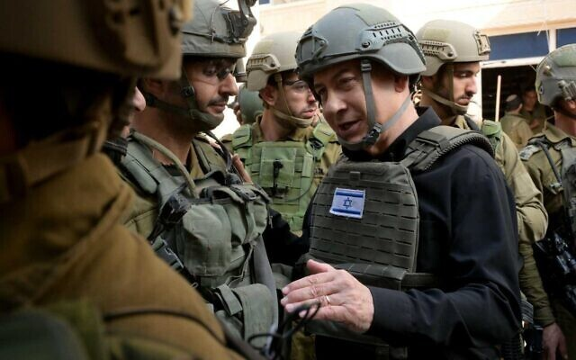
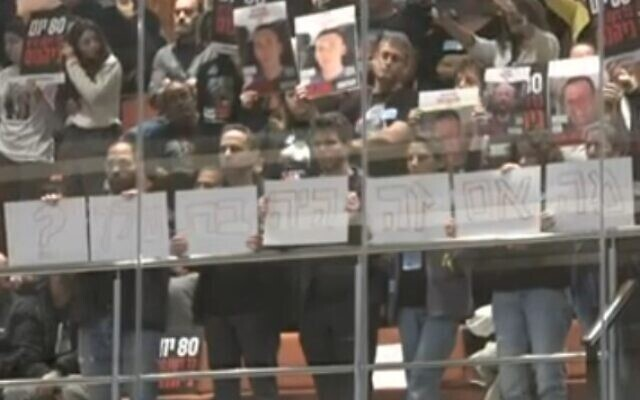
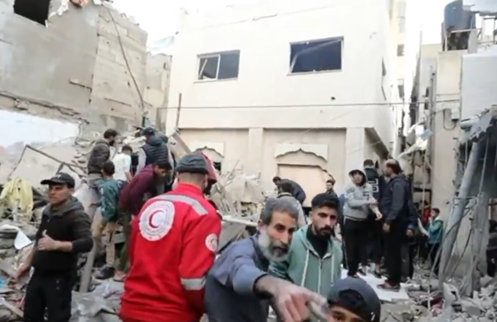

# “平安夜大屠杀”后，以色列总理到加沙慰问士兵，坚称要“战斗到底”

（观察者网讯）当地时间12月24日晚至25日清晨，以色列空袭加沙中部的迈加齐难民营等多地，被外媒称作“平安夜大屠杀”。据美媒《纽约时报》和《以色列时报》报道，“屠杀”结束的几个小时后，以色列总理内塔尼亚胡到加沙北部前线慰问士兵，面对大量士兵和平民伤亡，仍坚称要“战斗到底”。

然而，内塔尼亚胡不顾人质安危、坚持战斗的态度，引起以色列人质家属的不满。当日晚些时候，从加沙返回的内塔尼亚胡出席议会会议，在发表讲话时遭到在场人质家属的一片嘘声。

_内塔尼亚胡25日来到加沙北部慰问士兵，图自内塔尼亚胡推特_

报道称，当地时间25日，内塔尼亚胡来到加沙北部慰问士兵，听取了以色列国防军现场指挥官通报的战争进展，以及军队在该地区发现的大量弹药和地道。这是他自本轮巴以冲突以来第二次到访加沙地带。

根据以色列总理办公室发布声明，内塔尼亚胡告诉在场士兵：“我有两件事要说：第一，我们将尽一切努力保护你们的安全，我们希望（完成）这项任务，也希望尽可能地保护你们；我们不会停止战斗……战斗将持续到最后，直到我们完成任务。”他补充说，“这将是一场漫长的战斗，且远未结束”。

当日晚些时候，从加沙返回的内塔尼亚胡出席在以色列议会举行的特别会议并发表讲话，称以色列正在“尽一切努力”将被扣押在加沙的人质带回家，同时强调，这需要“军事压力”才能成功。他表示：“如果没有军事压力，我们不可能成功解救所有人质，我们不会停止战斗。”

内塔尼亚胡讲话还没结束，一名在议会旁听的人质家属喊道，“我们没有时间了”。随后，更多的人质家属开始高呼，“现在”、“现在”、“现在”，要求内塔尼亚胡政府应立即设法解救人质。

对此，内塔尼亚胡辩称，他正在尝试一切办法，包括亲自联系俄罗斯等国的领导人，他的妻子也曾直接联系教皇方济各。但他的解释遭到人质家属的一片嘘声。

25日晚，美媒《华尔街日报》刊发了内塔尼亚胡的署名文章，题为“和平的先决条件”。文章强调，以军的目的在于，“摧毁哈马斯，使加沙非军事化，并使整个巴勒斯坦社会去激进化”。但《以色列时报》注意到，内塔尼亚胡没有提及人质问题，也没有将解救人质作为“和平的先决条件”。

_人质家属在内塔尼亚胡讲话时大声抗议，手举人质照片以及“如果是你的女儿怎么办”的标语。以色列议会视频截图_

哈马斯于10月7日对以色列多地发动袭击，并扣押了大批以色列人质。当地时间11月22日，以色列与哈马斯于终于达成一项“人质换停火”的临时停火协议。自11月24日起，哈马斯共释放了108名被扣押人质。以色列方面称，截至目前，哈马斯仍在加沙地带扣押了129名人质，但并非所有人都活着。

新一轮巴以冲突至今已近三个月，自10月7日以来，加沙地带已有超2万人死亡，其中大多数为妇女和儿童。路透社称，在本月初为期一周的停战协议结束后，以军加大地面和空袭攻势，战事已从加沙北部蔓延至加沙全境，而停火谈判却陷入僵局。

尽管面临国际社会、美西方盟友和国内压力，以色列内塔尼亚胡政府仍一意孤行，坚持在加沙地带扩大战争，直到取得“全面胜利”。在战事日益严酷之际，当地时间24日，哈马斯下属武装派别卡桑旅发言人表示，过去四天，该组织杀死了至少48名以色列士兵。

就在内塔尼亚胡到访加沙北部的几个小时前，当地时间12月24日晚至25日清晨，以色列对加沙地带中部迈加齐难民营等多地进行“猛烈且密集”空袭。根据巴勒斯坦红新月会消息，空袭造成至少70人死亡，鉴于大批遇难者尸体和幸存者被困在废墟之下，具体伤亡人数远未确定。

 _医疗人员正抢救伤者，视频截图_

12月24日正值平安夜，基督教徒们开始圣诞夜的庆祝活动。半岛电视台以“圣诞夜大屠杀”为题，批评以色列空袭。路透社称，这是以色列在本轮巴以冲突期间发动的“最致命的单次袭击之一”，当晚，正主持弥撒的教皇方济各也发声谴责。

迈加齐难民营位于加沙中部，在战争初期接收了大量从加沙北部撤离的平民，人口非常稠密。半岛电视台称，以色列近几天采取了非常系统的空袭做法，目的在于“迫使当地居民继续往南部撤离”。

社交媒体流传的一段视频显示，迈加齐难民营遇袭后，难民营附近的阿克萨烈士医院外堆积了数十具尸体；视频还称，在以军的一次空袭中，来自同一个家族的68名成员丧生。半岛电视台称，这段视频的真实性已经得到该电视台记者核查。

伊朗外交部发言人纳赛尔·卡纳尼25日表示：“犹太复国主义政权在圣诞节前夕犯下的可怕暴行，暴露了这个实体不遵守任何神圣、宗教和国际原则的事实。”

国际救援组织“救助儿童会”发布声明予以强烈谴责，称以军对迈加齐难民营的空袭是加沙“遭遇持续恐怖的又一插曲”。声明指出：“家庭和儿童不应是军事目标，必须受到保护。我们需要立即和最终的停火。”

**本文系观察者网独家稿件，未经授权，不得转载。**

