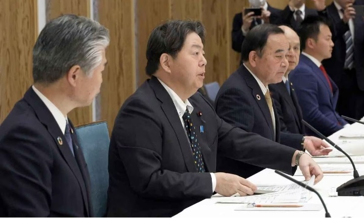
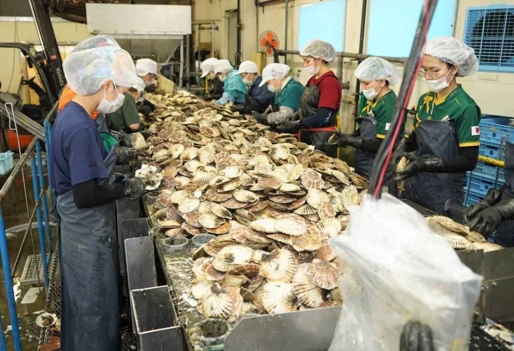

# 中国全面暂停进口，日本：将努力扩大扇贝对韩国及欧盟出口

（观察者网讯）据日本共同网和NHK电视台报道，12月25日，日本政府召开旨在扩大农林水产品出口的内阁会议。根据会议公布的执行战略，为消减中国暂停进口对于日本水产品行业的打击，日本政府计划开拓新市场，将扇贝等主要水产品出口至韩国和欧盟。

报道称，日本政府在最新执行战略中，维持了农林水产品出口总额到2025年增至2万亿日元（约合人民币1003亿元）的目标。其中，扇贝的出口目标额也整体维持在656亿日元。

中国一直是日本水产品最大出口国，其中扇贝是主要出口产品。今年8月，日本强行启动核污染水排海后，随后中国宣布全面暂停日本水产品进口。日本扇贝行业受到较大打击。

为重振扇贝行业，新执行战略提出开拓新市场的方针，将韩国和欧盟等地视作新的出口市场，并根据国家和地区设定了出口目标额：韩国41亿日元、欧盟45亿日元、泰国24亿日元、越南5亿日元。此外，日本还计划构建新的扇贝供应链，即在泰国等地剥壳加工后出口至美国等地。

对于中国全国暂停日本水产品进口一事，当天出席会议的日本内阁官房长官林芳正表示：“社会各界已认识到严峻的情况，将团结一心大力促进出口。”

_日本内阁官房长官林芳正（左二）25日出席会议并讲话，图自日媒《产经新闻》_

今年8月，日本政府无视国际社会的强烈质疑和反对，单方面强行启动福岛核事故污染水排海。同一时间，我国宣布全面暂停日本水产品进口，韩国、马来西亚等多国宣布将对日本进口食品采取严格检测措施。

值得注意的是，面对国际社会的强烈质疑和反对，日方试图以文字游戏混淆是非，将其经过多核素处理系统（ALPS）处理的核污染水称作“处理水”，并声称这种水安全无害，甚至符合饮用水标准。

但根据中国日报和经济日报报道，核废水和核污染水本质不同。核废水不会接触到核反应堆中的放射性物质，经过严格处理后，可以通过管道排出。核污染水指在事故中直接接触反应堆中放射性物质的水，由于受到沾染而具有高度放射性，需经过多道工序处理、专家评估后才能被允许排放。

 _位于北海道的一家扇贝加工厂，图自日媒《产经新闻》_

日媒此前援引日本水产厅数据显示，2022年日本水产品出口总额约为3870亿日元（26亿美元），并且在过去几年一直呈上升趋势。日本水产品对华出口约占总量的22.5%，中国是其最大的出口国，其中扇贝、鲣鱼、金枪鱼是对华主要出口品种。

在中国宣布全面暂停进口后，一时之间，日本国内水产行业相关人员“哀鸿遍野”。NHK电视台称，日本渔民和水产从业者闻此几近绝望，直言“震惊”、“今后将无法生存”；另一边，日本东京新闻注意到，在中国市场，日本水产品正逐步被澳大利亚、挪威等地和中国本土的水产品取代。

另据日本《产经新闻》9月份报道，作为主要出口水产品，日本扇贝捕捞、养殖和加工行业受到严重冲击。在位于北海道的冷藏设施中，扇贝及其加工品“堆积如山”，“发货已经完全停止”。北海道一名地方官员当时担忧地表示：“我们实在不知道今后将如何应对了。”

**本文系观察者网独家稿件，未经授权，不得转载。**

