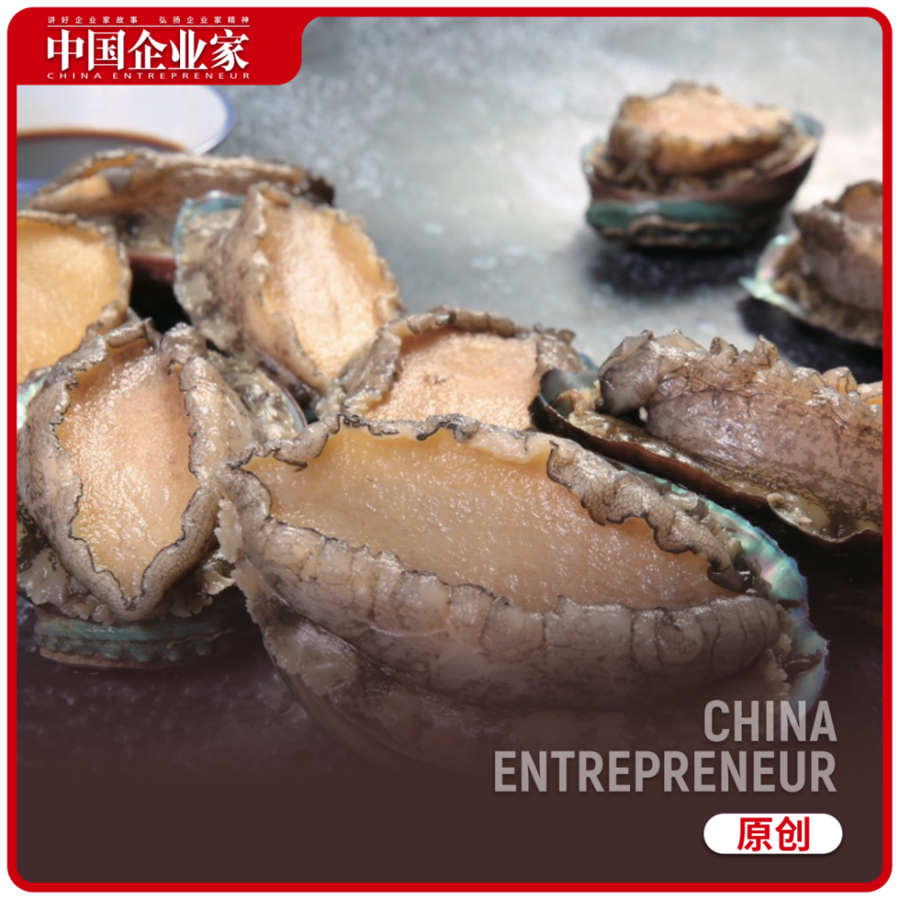
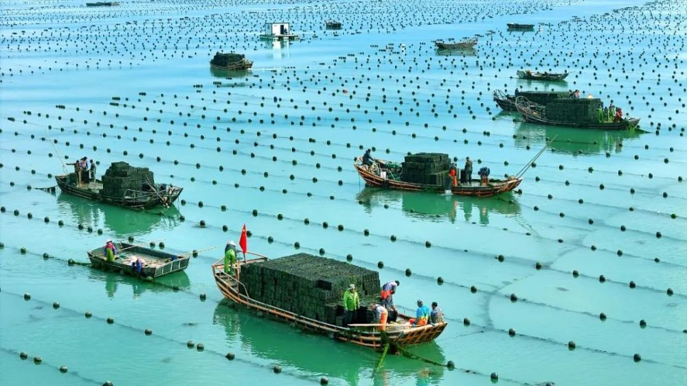
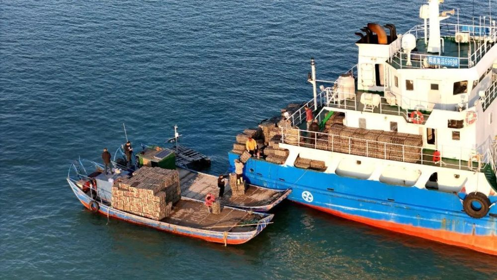
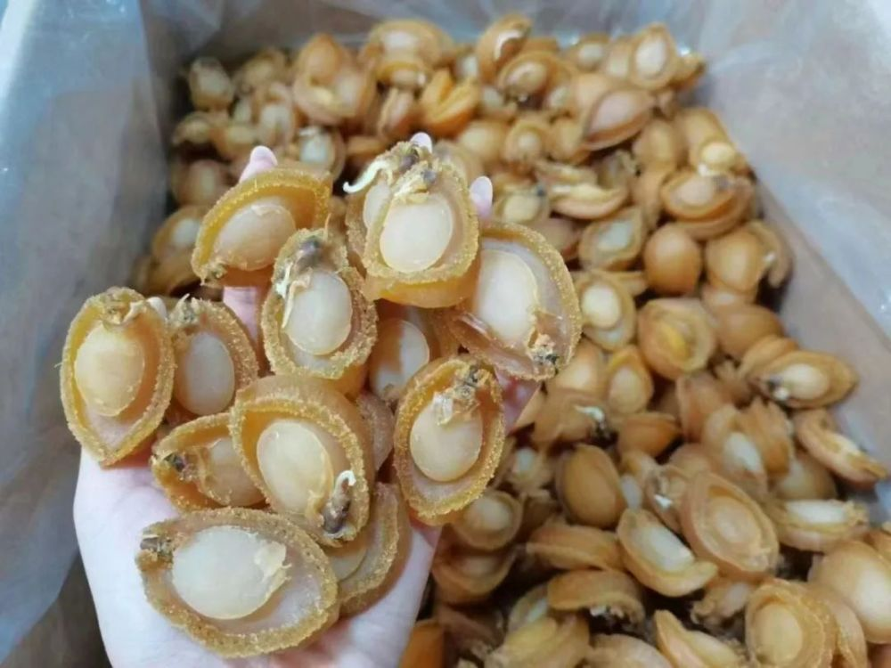

# 价格降至10年最低，靠鲍鱼“吃饭”的人要过冬了

与其被短期的价格波动所牵动，不如化被动为主动。

**文｜《中国企业家》记者 李欣**

**编辑｜赵建凯**

**头图来源｜受访者**

位于北京大红门的京深海鲜批发市场，是以海鲜批发为主营业态的综合性大型批发市场，也是华北地区最大的海鲜集散地。

开在这里的北京志忠鲍鱼行，经营鲍鱼生意已经有15年之久。在将近40平方米的门店内，摆放着约1000件鲍鱼，一年365天每天都会有新鲜鲍鱼送来。

“冬天送来的鲍鱼一般都是山东产的，夏季的鲍鱼普遍都是福建那边送来的。”一位店员告诉《中国企业家》。

作为鲍鱼经销链中的一环，她今年感知最明显的是，对比2019年及更早几年，今年鲍鱼的价格可以说是又跌至新低。

“鲍鱼今年的价格与往年比便宜很多，更亲民了。”这位店员回忆道，“2019年及之前的11月，我们这里8个头的鲍鱼批发价曾卖到过98、100元每斤，但今年也就50块一斤。

在鲍鱼养殖产业中，头数是衡量鲍鱼等级的标准之一，即每斤包含几个同样大小的鲍鱼。比如，“八头鲍”就意味着每斤有8个同样大小的鲍鱼，“六头鲍”即每斤有6个同样大小的鲍鱼。一般而言，头数越多个头越小，价格就越便宜。

降价的感知有据可依。据央视财经11月30日报道，今年国产鲍鱼的价格为近10年最低。

在从事鲍鱼育苗工作的陈帆看来，鲍鱼能降价，主要原因在于养殖技术的发展与养殖户的增加，二者助推了鲍鱼产量的上升。可佐证其说法的一组数据是，目前我国已成为世界上第一鲍鱼养殖大国，年产量超20万吨，已经占到世界总养殖量的85％以上。

**长期来看，鲍鱼价格走“下坡路”是不争的事实，但靠鲍鱼“吃饭”的人，他们的心弦，则更容易被短期的价格波动所牵动。**

身处鲍鱼产业链上游的陈帆，早早预判了明年（2024年）的“不乐观”。

据他观察，这两年饲料价格都处于相对高位，养殖户成本投入较多，但消费端并没有太热情。因此，陈帆也并不确定，手中这批等待明年清明节出货的鲍鱼苗，能否也卖个好价格。

从事冻品鲍鱼加工的福建鑫盛威食品有限公司的销售总监苏尊发告诉《中国企业家》，或受制于饲料价格波动上涨的原因，今年五六月份鲍鱼的收购价格，整体比往年上浮了10%左右。“当时价格上涨了，但该收购还得收，毕竟涨价是全市场都在涨价。”苏尊发表示。

但令苏尊发没想到的是，年关将至，鲜鲍鱼价格也没涨上去。“鲜鲍价格的走低，对于我们而言并不是一个好消息。”苏尊发解释道，尽管随着技术的成熟，冻鲍实际口感也并不会比鲜鲍鱼要差，但当冻品鲍鱼和鲜鲍鱼价差不大时，大众普遍会依靠第一直觉认为鲜鲍更新鲜，从而优选鲜鲍。冻鲍就成了略显被动的一方。鑫盛威在2022年的年加工量将近3000吨。

如今，又到了苏尊发一年中最忙的时候，尽管外部挑战颇多，但他也没闲着，开始以各种方式联络客户，“努力了一年了，总要给2023年完美结尾”。

需求减少，波动下降

与直接面向消费者的零售海鲜店不同，志忠鲍鱼行的主要客户为餐厅饭馆，以及中小型的海鲜店。按过去的经验来看，每年10月之后，酒席增多，外加元旦、春节等节日的到来，鲍鱼价格往往会呈逐步上涨态势，市场将逐步进入鲍鱼销售的旺季。

但今年出现了一些差异。“今年鲍鱼价格没涨上来，比往年还便宜了很多，很难说是高端食材了，顶多算中端。”一位在鲍鱼行工作了十余年的店员感叹道。

博海旺京海鲜店的老板也有类似的感受。在他眼里，这十余年，鲍鱼价格一直不高，波动下降，但高低之间至多差出来十块钱。“这主要还是销售端需求量在减少。”他告诉《中国企业家》。

“我这边也主要是饭店在拿货。2019年之前那几年，销量最好的时候，能在一天之内卖掉1000斤鲍鱼。”该老板回忆道，“现在600斤的鲍鱼，差不多需要3天左右可以清货。”今年，他的海鲜店已经不再专门从原产地养殖户手中批发鲍鱼，主要是靠经销商发其他大货时，一起代发过来一些鲍鱼。

除了C端的需求存在一定的下降外，在福建海宝源渔业从事育苗工作的陈帆则向中国《中国企业家》表示，
**从更长远的时间维度来看，鲍鱼价格波动下降的背后，是养殖户数量的提升和“科技农业”共同作用的结果。**

陈帆所负责的分公司，有2000个专门养育鲍鱼苗的“育苗池”，每个池子的面积大概在15~18平方米，一年内能培育三四万只大小在1.5公分左右的鲍鱼苗。陈帆和团队每年能培育约8000万只鲍鱼苗，在福建东山县当地，这种育苗规模已属头部梯队。

在从事育种工作的五六年，他明显感知到养殖鲍鱼的人数在增多，“最直接的表现就是养殖场一直在增多、扩建。”他还告诉《中国企业家》，现代鲍鱼养殖业应该叫“科技农业”，即随着技术的提升，鲍鱼的种类增多、产量提升，供给多了，价格势必会下跌。

“科技农业”的表现还有“南北接力”养殖鲍鱼。

要知道，鲍鱼是一种对生长条件要求极为苛刻的生物。一般而言，鲍鱼生长最适宜的水温是在12℃至25℃之间，温度过低或过高都易引发鲍鱼停止生长甚至死亡。

据《大众日报》报道，为了提升鲍鱼养殖效率，从2011年开始，为了应对北方冬季水温过低、天气严寒，南方夏季温度太高、时有台风的情况，山东省荣成市和福建省的部分鲍鱼养殖地区开始开展鲍鱼南北转场、冬夏对调养殖合作。

_东威海开展鲍鱼南北转场合作。来源：视觉中国。_

每年4~5月份，在南方水域完成“过冬”的荣成鲍鱼返回北方，与它们一同北上“避暑”的还有一批“福建鲍鱼”。而等到了11月，两地鲍鱼再一起回到福建。

**这种“南北接力”养鲍鱼的方式，使鲍鱼能够最大程度地处于适合生长的环境中，以便尽可能地提升鲍鱼的生存率，从而提高产量。**
公开资料显示，2021年，山东荣成市鲍鱼产量3万吨，占全省的84%，全国的13.8%。同期，福建省福州市连江县鲍鱼产量也高达5.35万吨。

“因此，长期来看，鲍鱼价格走低的背后就是供需关系在变，产量提升但需求并没有跟着提升，从而导致了鲍鱼价格的走低。”陈帆表示。

多年来， **养殖效率的提升，叠加成本的相对降低，助推了产量规模的走高，进而使得鲍鱼价格呈现波动下降的走势。**
但比起技术和产量带来的长期影响，产业链上靠鲍鱼“吃饭”的人，更在意也更容易受到短期的波动。

靠鲍鱼“吃饭”的人

每年5~6月份，是福建鲍鱼最肥美的时节，也是福建鑫盛威食品有限公司最忙的时候。时至鲍鱼产季，公司采购会集中赶到位于平潭、连江的上游养殖户处去收鲍鱼。

“5~6月份出产的鲍鱼质高、量多、价低，所以我们收购和加工期基本都集中在5~6月份。”苏尊发介绍道。

但今年，苏尊发感觉到鲍鱼的收购价明显贵了一些。“今年产季，鲍鱼收购整体价大概是三四十元每斤，与2022年相比上浮了10%左右。”

而导致价格上浮的主要原因，则在于上游养殖户喂给鲍鱼的饲料。据苏尊发介绍，饲料是鲍鱼养殖的主要成本之一，而现在福建地区鲍鱼养殖户喂给鲍鱼的主要饲料是人工投喂的海带和龙须菜。从鲍鱼壳就可以大致判断出鲍鱼吃过什么，吃龙须菜较多的鲍鱼外壳呈褐红色，而吃海带较多的鲍鱼壳则偏绿色。

近些年， **大多数养殖户都遵循着“哪个便宜喂哪个”的原则，而海带和龙须菜价格的变动，也牵动着短期内鲍鱼的价格走势。**

“近年，福建这边的海域许多人也开始养海参，海参的饲料中也有海带，也变相带动了海带价格的上涨。传导至养殖户那边，成本也相对提升了。”苏尊发告诉《中国企业家》，“这种影响都是有滞后性的。去年海带涨价，不会带动当时市场的鲍鱼涨价，因此当时收购的价格还算低，但等到今年加工期时，受到去年饲料价格的影响，鲍鱼的收购价格就相对较高了。”

 _鲍鱼苗“乘船”南下，转场至福建“越冬”。来源：视觉中国_

不过，尽管收购价格偏高，在今年产季，鑫盛威依然按照原定的生产计划收购、加工了鲍鱼。“今年的加工计划，基本是根据去年的市场供需情况和加工期鲍鱼价格的变动幅度来制定的。去年鲍鱼销量较好，所以今年即使偏贵了一些但整体还能接受，因此依然加工了很多。”苏尊发表示。

鲍鱼的产季，同样也是冻品鲍鱼的销售旺季。销售总监苏尊发介绍道，出货最多的时候，一天之内，长“17米”、载货量在20吨左右的货车，能发出去3到4车。“冻鲍运输比鲜鲍方便很多，品质稳定，存储也比较方便。因此在产季的时候就有很多人囤货。”

但年关将至，鲜鲍价格的“腰斩”，让做冻品鲍鱼生意的苏尊发，也有点意外。

在他看来，外界并不了解如何分辨冻品鲍鱼和鲜鲍鱼的品质。当冻品鲍鱼和鲜鲍鱼摆在一起时，普通老百姓、不太懂行的餐饮店老板都会依靠第一直觉，认为既然可以用便宜的活鲍鱼，为何还要用冻品鲍鱼？

“很简单，就比如普通消费者去饭店吃鲍鱼，冻鲍鱼和鲜活鲍鱼二者价差不大时，大多数消费者肯定优先选鲜鲍鱼，大众对加工品还是存有一定的偏见的。”苏尊发类比道。

但在他看来，相较于鲜鲍鱼，冻品鲍鱼品质更稳定，受运输环节影响更小。且 **现在的冻鲍鱼加工技术也比较成熟，做成菜品的实际口感，并不会比鲜鲍鱼要差。**

而对于年底鲍鱼价格难往上走的情况，苏尊发还认为与“日本核污染水”或也存在一定的相关性。他向《中国企业家》回忆道，今年8~9月份，日本福岛第一核电站正式启动核污染水排海的那两个月，实际上是促进了一波消费。

“我们公司当时最直接的感受，就是产品需求量猛涨了一波。”苏尊发表示，“当时的客户或是考虑到未来的影响进行了提前囤货，所以也不排除当时有囤货，从而导致现在市场存在一定的饱和度。”

今年，龙须菜等饲料价格忽高的现象仍在。从事育苗工作的陈帆向《中国企业家》透露，他从下游养殖户处了解到，福建地区的龙须菜价格多在1元/斤，但今年最高峰的时候曾攀至4元/斤。

“正常来讲，龙须菜涨到2块钱时，养殖户就不怎么赚钱了，今年的饲料成本还是相对偏高了。”陈帆解释道。

东山县鲍鱼苗的养殖周期基本为半年，陈帆今年的这一批苗，要到明年的清明节前后才会出手，但对于明年的行情，陈帆并不乐观，“养殖户亏钱的不少，明年我们的苗大概也很难卖出一个好价格。”

鲍鱼真的飞入寻常百姓家了吗？

过去很长一段时间里，鲍鱼常被冠以“贵族菜系”，高价难亲民，是高级餐厅的标配。

如今以加工鲍鱼为生的苏尊发，在小的时候也曾一度认为，鲍鱼是“可望而不可即”的高端食材。

“我是在安徽的农村长大的，小时候常常听到燕窝、鲍鱼，外加农村的酒席上通常也看不到鲍鱼，所以很长一段时间里都觉得鲍鱼很贵。”苏尊发回忆道。

现在，几乎日日与鲍鱼打交道后，苏尊发早已对鲍鱼“祛魅”。在从事冻品鲍鱼生意的这些年中，潜意识里，他也希望将这一曾经大众眼中的高端食物加速推广，使其“飞入”更多寻常百姓家。

_来源：受访者_

但一个必须承认的事实是，
**尽管这些年中国鲍鱼在世界总产量中占据了绝对地位，但产值却跟产能不匹配，核心原因，即国内的鲍鱼主要以鲜鲍形式被消费掉了，而国外的则基本上是干鲍，附加值很高。**

换言之，价格在逐步贴近大众的，也是鲜鲍鱼，部分干鲍鱼价格仍让人“望而却步”。

且某种程度上，干鲍才是鲍鱼的顶级形态，而所谓“鲍参翅肚”中的“鲍”，指的也是这种经过复杂工序制作而成的干鲍。

即便是如今鲍鱼产能释放，但相较于鲜鲍，干鲍仍是“高岭之花”。从事海鲜水产生意的尹国东向《中国企业家》介绍道，自己所售卖的干鲍鱼40头的售价在380元每斤，属于中档产品。市场上比较高端的产品有10头、8头的大鲍鱼干，价格相对更贵，考虑到目标客户，暂未涉及到这些产品。

“干鲍鱼需将鲜鲍经过一系列腌制、晾晒、发酵等步骤制成，但非所有鲍鱼都能被制作成干鲍。根据干度的比例不同，重量也相对减轻，故单价也相应增加。另外，干鲍更容易长时间保存，且后期泡发用来煲汤、炒菜，它的口感也更结实，更香。”尹国东解释道。

换言之，如今大众所实现的鲍鱼自由，某种程度上可以说是“鲜鲍”自由。

但无论是鲜鲍、冻鲍还是干鲍，年关将至，鲍鱼这条产业链上的人，都铆足了劲准备“大干一场”。

尹国东也是其中之一。年关将至，他清点库存，等待更多销售机会。“一般节假日，是干鲍销售最好的时候，大家主要是买来送礼，我这边的干鲍销售量在整体产品占比中比较少，所以备货不多，如今库房中产品还足够销售。”尹国东表示。

从11月开始，作为销售总监的苏尊发也开始以各种方式联络客户。除了每年5~6月份的加工期外，现在是他最忙的时候。

每年此时，一些客户都会加大冻鲍进货量。“一方面是年夜饭、酒席将迎来一个高点，其次冻鲍也能作为大礼包，用来送礼。所以需求比较大。”苏尊发解释道，“过年期间物价上涨，冻品也相对容易保存，低价的时候多囤一点，冻品商也能赚得更多的利润。”

市场风向难捕捉，鲍鱼价格也永远牵动着产业链上每个人的心弦，但涨涨跌跌，无论鲍鱼价格怎么变，他们能做的只有拿出勇气，竭尽所能，继而迎接下一轮产季的到来。

文中陈帆为化名

参考资料：

《“一”见丰收丨鲍鱼价格越来越亲民》，大众日报

《鲍鱼，“天价极品”与“大路货”之间》，云无心是我

