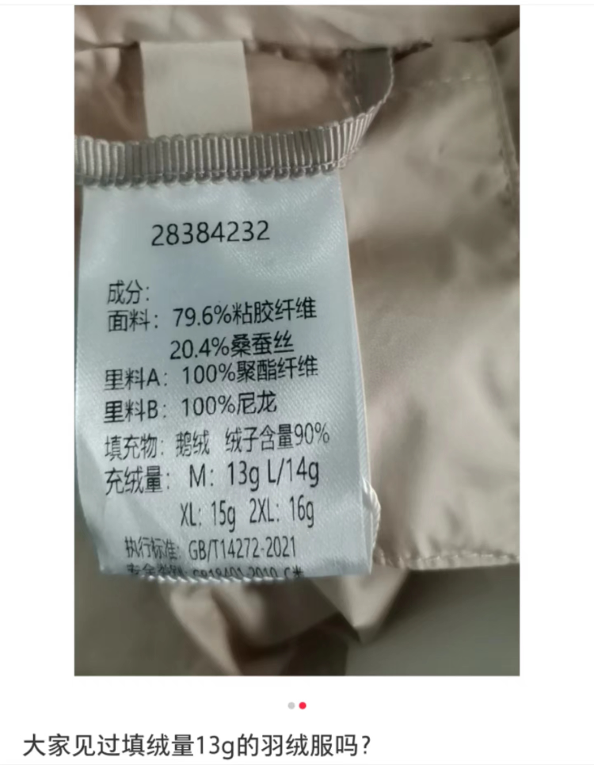
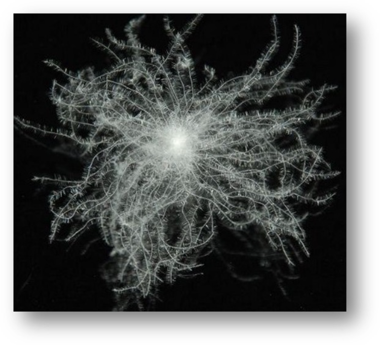
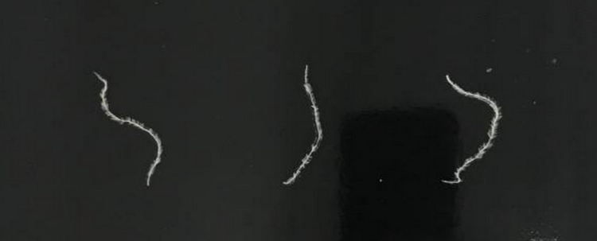

# 女子网购500多元羽绒服含绒13克？专家：充绒量没有规定

“13克的充绒量能算是羽绒服吗？”近日，深圳一位女网友发帖称，因为近期降温，自己在网上花500多元购买了一件薄款羽绒服，到手后发现很轻，一看充绒量仅13克，这引来不少网友的关注。12月25日，中国羽绒工业协会的专家告诉上游新闻（报料邮箱baoliaosy@163.com）记者，按照新国标，绒子含量低于50%就不能叫羽绒服，对于充绒量没有明确规定，而羽绒服的价格主要跟做工用料和品牌溢价有关，跟充绒量并没有太大关系。

**13克充绒量让网友感到不可思议**

22日，一位深圳女网友发帖称自己被网购的羽绒服震惊了，“真是离了个大谱，买了件羽绒服，拿到手上一摸挺薄的，压根就摸不到绒，一看填绒量13g，真的是服了，13g的充绒量能算是羽绒服吗？虽说是薄款羽绒服，但是13g也太薄了吧？也不知道大家见过13g充绒量的羽绒服没有，反正我是没见过。”

_网友发帖吐槽。网络截图_

上游新闻记者看到，在羽绒服的标签上标注填充物为鹅绒，绒子含量90%，充绒量M码为13克，L码14克，XL码15克，XXL码16克。帖子的内容也让网友们感到不可思议，“13克就算了，关键还500多。”有网友就表示“鸭子扑扇下翅膀掉的毛都比你羽绒服多。”还有网友发现自己一两千元购买的羽绒服，充绒量也仅有30多克。

25日，上游新闻记者联系到了这位发帖网友，她表示已经和商家进行了沟通，不过随后以“没有什么好解释的，不愿意小题大作”为由挂断了电话。

根据图片，上游新闻记者在某电商平台上找到了多家售卖类似薄款羽绒服的商家，他们在图片中也展示了服装标签，内容与深圳网友展示的标签图片一致，强调选用2021新国标羽绒标准，定价从400到500元不等。

 _网友拍到的标签显示充绒量13克-16克。网络截图_

上游新闻记者询问了多家店铺的客服，都确认衣服是只有十多克羽绒，其中一位客服人员解释，“衣服是真丝丝绒的面料，比较御寒保暖，十多克的羽绒在广东完全没有问题。”另一店铺的客服则强调：“在广东不用太厚的，这是薄款羽绒服，就是15度左右穿的。”

**新国标“含绒量”修改为“绒子含量”**

多少充绒量才算是一件合格的羽绒服？2021新国标羽绒标准又是怎么规定的？

25日，中国羽绒工业协会信息部主任祝炜告诉上游新闻记者，羽绒服在充绒量上没有具体充多少克的规定，“标称有一个上下浮动，不能超过5%负偏差。”

那么深圳网友购买的羽绒服标签上显示13克充绒量与90%绒子含量是否矛盾呢？祝炜用溶液打了一个简单的比方，“绒子含量相当于浓度，充绒量相当于有多少克这种物质，90%绒子含量的羽绒服可以简单理解为100克有90克都是绒子，只要符合这个标准，质量就是好的。”

_绒子。国家标准化管理委员会官网_

至于为什么羽绒服有的充得多，有的充得少，“因为200克左右的羽绒服可能都是冬季来穿的，但现在羽绒服有些是秋天就推出了，不需要保暖性那么强，就做得比较薄一点，充绒量就会相对少一点。”祝炜解释，南北方保暖性需求又不一样，“比如说在深圳气温没那么低，充个二三十克、三四十克就够了，但北方就不行。”

上游新闻记者注意到商家宣传中的2021新国标羽绒标准即GB/T14272-2021（以下简称新国标），于2022年4月1日正式实施，最大的亮点是把旧国标中的“含绒量”修改为“绒子含量”。

羽绒服中的绒子是朵绒、未成熟绒、类似绒和损伤绒的总称，呈蒲公英小伞状，比较蓬松，是一朵羽绒中最优质的部分。而绒丝是朵绒上掉下来的单丝，呈一根一根的丝状，没有蓬松感。

_绒丝。国家标准化管理委员会官网_

祝炜介绍，从科学角度来看，在羽绒服中实际发挥保暖作用的是“绒子”，而旧国标中的“含绒量”包括绒子和绒丝，达到50%就算合格，一些不法商家会在羽绒服里填充很多绒丝废料，号称含绒量90%。

新国标不再将没有保暖作用的绒丝废料计入含绒量，这意味着对填充羽绒的品质要求更严格，祝炜表示：“并不是说超过50%绒子含量就是合格，而是低于50%就不能叫羽绒服。”

**羽绒服的价格并不只看绒子含量**

绒子含量、充绒量与羽绒服的定价有关系吗？业内人士介绍，通常来看，绒子含量越高，羽绒服越贵。祝炜也表示，这主要还是看做工、用料和品牌的溢价能力，“比如都是充200克绒，加拿大鹅可能要1万块钱，而其他品牌可能只要300块钱。”

据中华全国商业信息中心数据，2015年到2020年间，中国的羽绒服均价从438元升到656元。上游新闻记者在淘宝上看到，销量最高的几款本土品牌羽绒服，绒子含量从80%到90%不等，充绒量根据尺码从90克到250克不等，价格也从129元到399元不等。

_新国标中的相关规定。_

而中端市场的本土品牌波司登，单价已经达到了1500元以上，近来也饱受争议，其财报显示，包含广告宣传费用、租金及雇员开支等在内的分销开支2017/18财年为24.52亿元，2021/22财年已经上涨至61.71亿元。

上游新闻记者也注意到，羽绒服新国标施行一年多，一些品牌在宣传上仍未规范，如淘宝上某热销品牌羽绒服仍在使用“含绒量”的称谓，而某国外知名品牌的薄款羽绒服，充绒量只标注了“小于100克”，并未标注实际重量。

发帖质疑的深圳网友认为，商家在商品详情页从头到尾都没有明确写过充绒量多少，“如果你告知了，我下单购买，那是我的问题。”

那么消费者如何正确选购羽绒服？“影响羽绒服保暖程度的因素主要是绒子含量、充绒量和蓬松度。”祝炜建议：“一般初冬季节选择的轻薄款羽绒服充绒量在40~90克；一般厚度的短款羽绒服充绒量为130克左右；中等厚度的为180克左右；适合北方户外穿着的羽绒服充绒量要在180克以上”。而蓬松度通俗来说，就是羽绒越蓬松，储存的空气越多，保暖性能就越好。

上游新闻记者 汤皓

