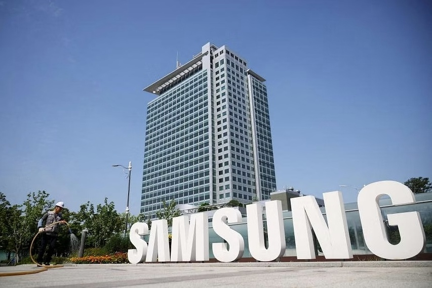
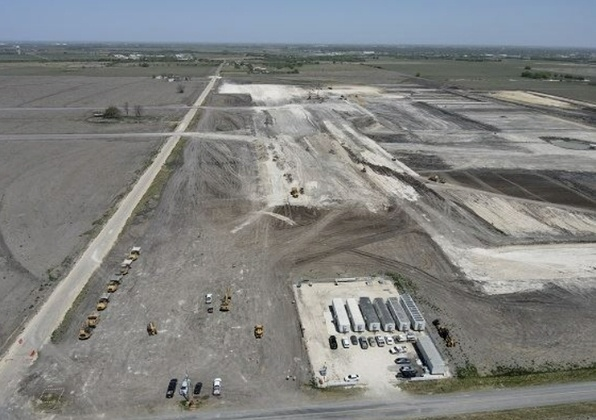

# 拜登政府半导体计划受挫？继台积电后，三星在美新建芯片厂进度延迟

腾讯科技讯
12月26日消息，据外媒报道，三星电子的一名高管在美国参加活动时表示，他们位于美国得克萨斯州的泰勒新工厂量产时间已经从2024年推迟到了2025年。这一变动可能会对拜登政府增加美国半导体供应的计划造成重创。

之前，三星在2021年宣布投资时表示，该工厂将于2024年下半年投产。现如今，一位三星公司的发言人表示，目前公司还未确认量产计划。有推测认为，此次推迟可能与美国政府的补贴发放和各种与之相关的许可证审批有关。此外，经济复苏的不确定性也可能影响了三星电子的投资决策。

据业内人士预计，泰勒工厂在明年可能只会进行小规模的设备安装，并不会全面投产。三星原计划在明年上半年以后，建立月产5000片12英寸晶圆的生产线。但与三星最近在韩国平泽3号工厂建设的4纳米生产线（每月可处理2.8万片晶圆）相比，泰勒工厂的规模确实较小。

在过去两年里，三星电子投资了170亿美元建设泰勒工厂。这座工厂占地长达一公里，有很大的扩展空间，除了第一条生产线外，还可以再建十个额外的生产线。该工厂的初始生产线将用于生产4纳米半导体。

 _图：三星电子公司在美国得克萨斯州泰勒市的新半导体工厂施工现场_

此前，三星的竞争对手台积电决定将其亚利桑那州新工厂的生产从明年推迟到2025年，原因是缺乏经验丰富的建筑工人和机器安装人员。

这两家全球领先的芯片制造商在美国建厂的进度有任何延误，都将对美国总统乔·拜登（Joe
Biden）提高美国本土芯片生产计划造成重创。而台积电和三星调整投产计划意味着，这些新工厂可能要到明年美国总统大选后才能投产。（编译/金鹿）

