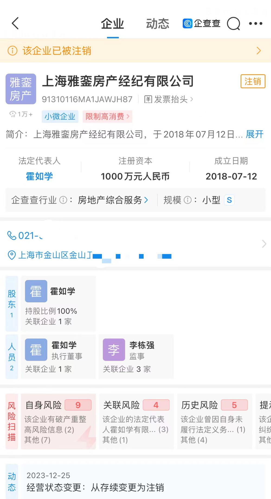
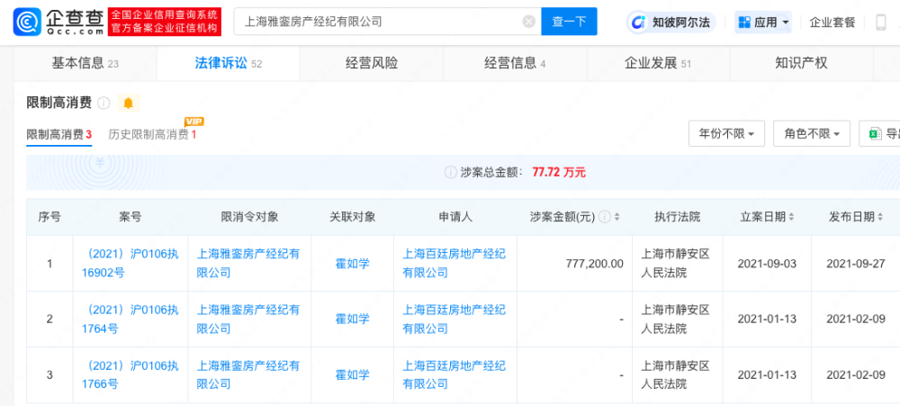
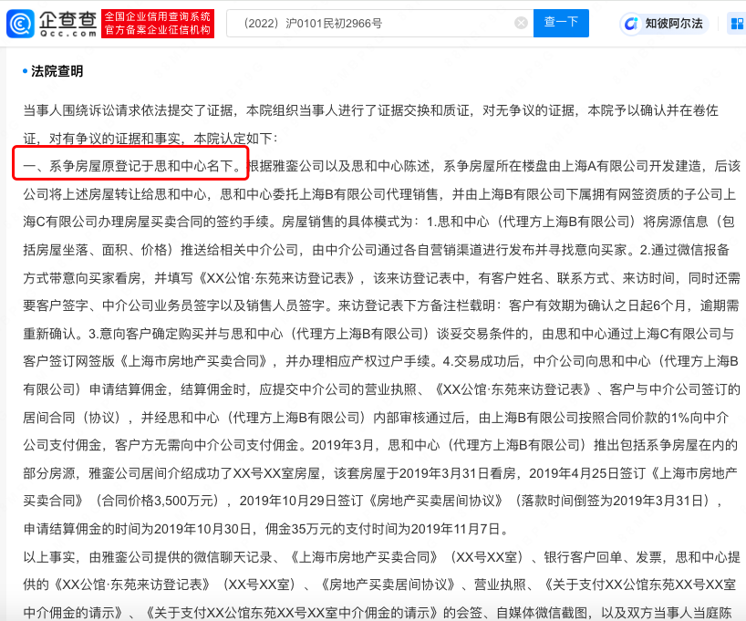
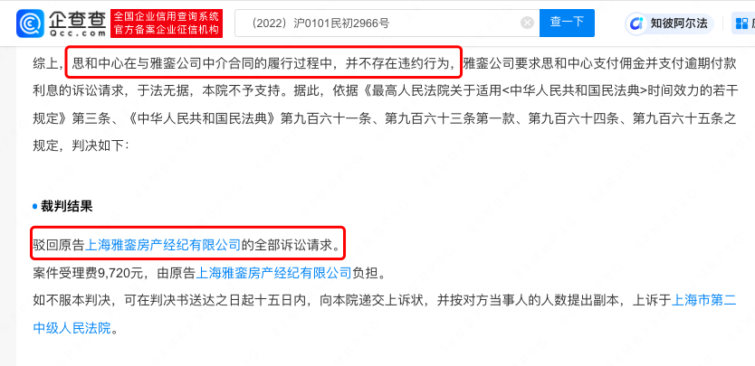
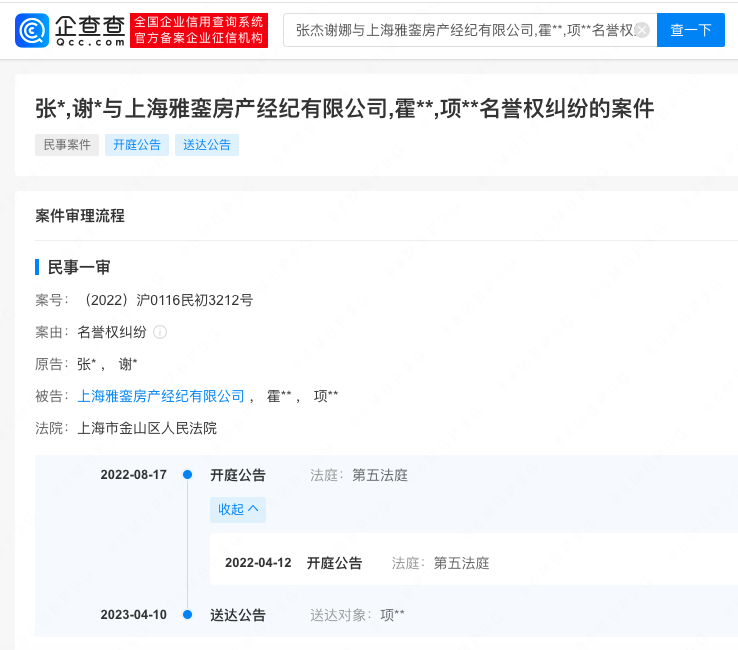

# 指责张杰谢娜“跳单”中介公司注销

企查查APP显示，近日，上海雅銮房产经纪有限公司经营状态由存续变更为注销。该公司目前名下多则限制高消费信息，涉案金额77万余元。

此前，曾有中介在网上发文怒斥张杰谢娜夫妇买豪宅“跳单”。对此，谢娜张杰方发律师声明，辟谣跳单等为不实信息。

裁判文书显示，上海雅銮房产经纪有限公司起诉上海思和资产经营管理中心的中介合同纠纷案一审败诉，法院认定张杰、谢娜购房不存在“跳单”行为，驳回上海雅銮房产经纪有限公司的全部诉讼请求。

今年4月，张杰谢娜已因名誉权纠纷起诉该公司。

**【来源：企查查APP】**

**声明：此文版权归原作者所有，若有来源错误或者侵犯您的合法权益，您可通过邮箱与我们取得联系，我们将及时进行处理。邮箱地址：jpbl@jp.jiupainews.com**

