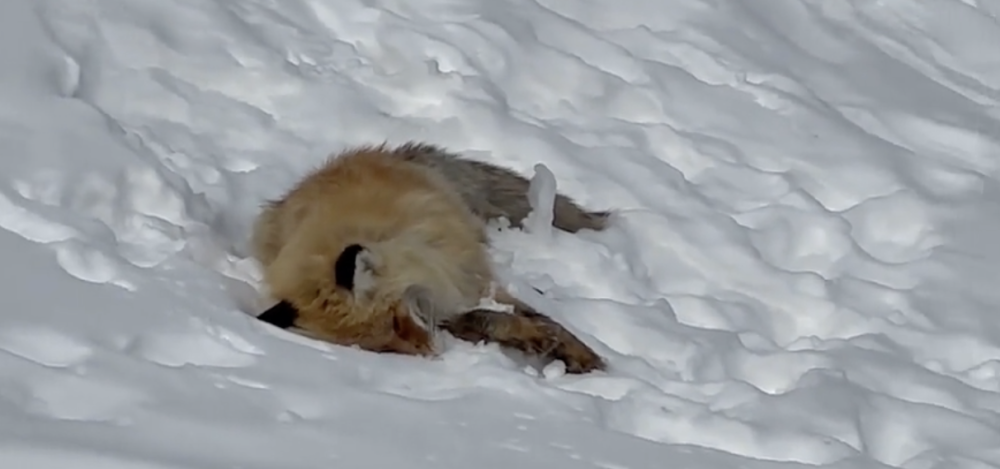

# 游客称新疆喀纳斯网红小狐狸疑因投喂死亡 景区：暂未收到消息，需专业诊断确认

12月25日，新疆阿勒泰地区，有游客发视频称喀纳斯网红小狐狸死亡，视频中一只狐狸躺在雪地里一动不动。知情人称，小狐狸死亡应该和投喂食物有很大关系。此事引发网友关注。

26日上午，喀纳斯景区工作人员告诉红星新闻记者，景区暂未收到相关信息，需要联系当地的野生动植物保护协会等相关组织，经专业人士诊断才可以确认小狐狸是否已经死亡。此外，野生动物冻死或被抓死在野生环境都比较正常。针对游客投喂食物一事，该工作人员表示有安排工作人员在现场提醒，但收效甚微。

**知情人称游客投喂致小狐狸掉毛等**

**景区：曾组织人员提醒禁止投喂，收效甚微**

12月25日，知情人宋女士介绍，几年前当地下了一场大雪后，这只小狐狸就下山找吃的。有些游客看到后会好心地去投喂，投喂的都是火腿肠等高油高盐的食物，导致狐狸掉毛、患皮肤病等。

“今天有人上山时发现小狐狸一动不动，已经死了，应该和投喂食物有很大关系。”宋女士介绍，“这只狐狸很有名，我们一直见的就是这只。”由于狐狸是国家保护动物，不敢随意处理，于是报警处理。

 _▲游客发视频称喀纳斯网红小狐狸死亡 视频截图_

据12月中旬曾到阿勒泰地区旅游的网友回忆，当时，他们在去喀纳斯景区路上遇到了网红小狐狸，看到有游客投喂巧克力、火腿肠等食物，“小狐狸已经有一部分尾巴掉毛了。”

26日上午，喀纳斯景区工作人员告诉红星新闻，景区暂未收到相关信息，需要联系当地的野生动植物保护协会等相关组织，经过专业人士诊断才可以确认小狐狸是否已经死亡，具体情况景区咨询处尚不能确定。随后，记者联系到阿勒泰地区林业和草原局办公室工作人员，对方表示，尚不清楚该事件，会进行核实。

上述景区工作人员受访时介绍，野生动物冻死或被抓死在野生环境都比较正常。针对游客投喂食物一事，景区工作人员表示有安排工作人员在现场提醒，但收效甚微。

红星新闻注意到，12月25日，阿尔泰山国有林管理局布尔津分局发布了致广大游客朋友们的公告。公告称，今年以来，布尔津县喀纳斯、禾木景区游客络绎不绝。沿线各类野生动物出没频繁，给广大游客出游带来更多惊喜。个别游客因好奇和爱护动物心理，给野生动物投食现象时有发生。“您可能不知道，投喂人类食物，可能会破坏野生动物自然寻食本能，从而影响生存能力和野外独立生活的能力，造成种群扩张和病害传播。另外，人类食物中的高糖、高盐、高脂肪等成分，会造成野生动物肥胖，影响动物心血管健康，还会造成骨骼变形、脱毛、器官衰竭，甚至死亡等严重危害。”

公告称，“我们诚挚呼吁大家禁止给野生动物投食，呵护野生动物的自然生活环境，为野生动物们营造一个安全的家园。”

**专家：**

**随意干预野生动物生存法则不可取**

今年10月，可可西里一头孤狼也因为被游客投喂成为网红狼。孤狼原本瘦骨嶙峋，有游客因狼被喂食长胖而高兴，不过也有许多专家提醒，给野生动物投喂容易引发意外伤害，也违背了自然规律。

中科院成都生物研究所研究员戴强此前接受红星新闻采访时介绍，投喂野生动物一方面可能给自身带来风险。野外生存的野生动物尤其受伤的动物有可能携带致病病菌，同时无法保证它是否有攻击性。另一方面，随意干预野生动物生存法则不可取。“除非是濒危物种，而且是因人为原因造成的，否则不建议人工干预。”

戴强称，自然界的生态系统是一个复杂的食物链，动物生老病死、优胜劣汰本来就是自然规律，动物生存自有其法则。此类投喂行为还可能引发动物的依赖性，产生不良后果。

据了解，很多自然保护区、国家公园，乃至动物园，都醒目地提示“禁止投喂”，随意投喂引发对动物的伤害也时有报道。西宁野生动物园副园长、青海野生动物救护繁育中心副主任齐新章曾就投喂野生动物一事表示，游客不应随意投喂，“我愿意相信投喂者的善良，但是善良需要理性的支撑，否则就可能好心做坏事。”野生动物话题引起关注本身是好事，只有更多人了解野生动物，才能正确关心野生动物，才能采取正确的方法去保护野生动物。

红星新闻记者 蔡晓仪 实习生 谭惠哲

编辑 张莉 责编 官莉

