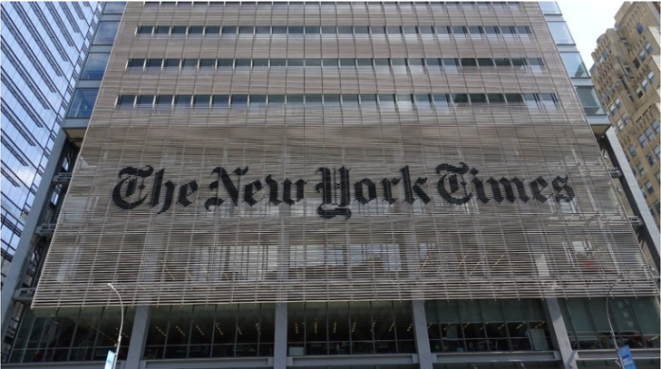

# 罕见！乌政府机构指责《纽约时报》“为克宫工作”，克宫也发声

【环球网报道 记者
张晓雅】据“今日俄罗斯”（RT）报道，乌克兰国家安全和国防委员会下属“反虚假信息中心”（CCD）25日发声明，指责美国《纽约时报》“为克里姆林宫工作”，还声称这家媒体的一些记者是被莫斯科“招募”的。RT说，针对《纽约时报》的报道，克宫发言人佩斯科夫也做出了回应。

 _《纽约时报》办公楼 资料图 图自RT_

乌方的指责源自一篇上周六（23日）的文章。RT说，这篇文章署名为《纽约时报》莫斯科分社社长安东·特罗亚诺夫斯基，以及特约撰稿人亚当·恩图斯和朱利安·E·巴恩斯，文章的标题是“普京悄悄发出信号，他对在乌克兰停火持开放态度”。

RT说，这篇文章引用“两名与克宫关系密切的俄罗斯前高级官员”以及美国和国际官员的话说，俄罗斯总统普京“至少从9月起就通过中间人发出信号，表示他愿意接受停火”。该报道进一步声称，克里姆林宫正利用“幕后外交”表明俄方“准备达成协议”。

“为撰写这篇文章，俄罗斯联邦动用了在俄罗斯工作期间被招募的美国记者。”CCD在社交媒体上发表的一份声明中说，但该机构并没有说明具体细节。

RT继续称，CCD批评《纽约时报》的报道角度，认为莫斯科可能是在发出一个“信号”，目的是“阻止西方对乌克兰武装部队的进一步军事援助”。CCD还表示，这篇文章可能是为了“提高”正在对抗拜登竞选连任的特朗普的“支持率”。

特朗普此前多次在竞选活动中表示，如果他重返白宫，俄乌冲突将很容易结束。

“人们不应忘记，俄罗斯正在玩一场‘和平’游戏，同时加大对国防工业的投资，建设其军队。显然，文章中没有提到它。”CCD说。

RT报道称，克里姆林宫发言人、俄罗斯总统新闻秘书佩斯科夫在回应时表示，《纽约时报》这篇文章的说法“并不正确”，他重申俄罗斯对乌克兰的特别军事行动战略没有改变。佩斯科夫补充说，莫斯科愿参与谈判“完全是为了实现自己的目标”。

 _佩斯科夫 资料图 图自俄媒_

在这篇报道评论区，有网友讽刺，“很快乌克兰就会开始告诉我们拜登实际上是俄罗斯特工。”

据俄罗斯卫星通讯社12月19日报道，普京在俄国防部部务委员会扩大会议上说：“在乌克兰、在欧洲、在美国，那些对俄罗斯有敌意的人想要谈判，那就谈吧。我们将以自己的利益为出发点进行谈判。”普京还表示，俄罗斯从未干涉，未来也不会干涉欧洲事务。普京说，“这是他们的选择，这是欧洲人民的选择，我们过去、现在和将来都不会干涉欧洲事务。”他表示，俄罗斯一定会做的是捍卫自己的利益。

