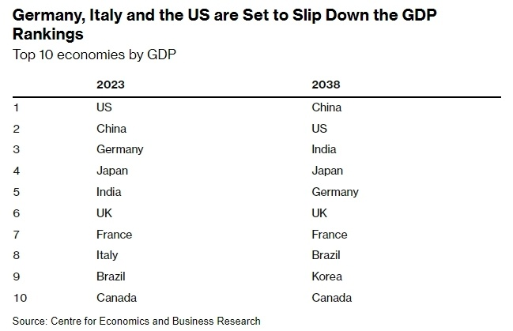

# 英国智库CEBR：中国可能在2037年超越美国，成为最大经济体

（观察者网讯）综合英国《每日电讯报》、美国彭博社26日报道，当地时间周二，英国智库“经济商业研究中心”（CEBR）公布的年度预测报告中称，考虑到房地产危机和后疫情经济复苏缓慢，中国将在2037年超过美国成为全球最大经济体，略晚于去年该机构预测的2036年。

同时报告称，随着中国人口老龄化问题的突显，美国可能在2050年代的某个时候“反超”，而全球最大经济体又将在2080年代时“易主”，改由印度坐阵。报道称，届时世界上或将出现“三个超级大国”，这也将对全球地缘政治产生影响。

_截图自彭博社_

据报道，CEBR的年度世界经济排行榜强调了未来15年世界可能面临的震荡性变化，中国、印度、巴西、韩国“上位”。其中中国将在2037年超过美国成为全球最大经济体，报道强调，发展中经济体赶超发达经济体，将推动世界GDP翻一番。

报告还称，继去年超越英国成为世界第五大经济体之后，到2038年，印度还有望超过日本和德国，成为世界第三大经济体。

彭博社特别指出，未来15年，英国也将逐渐摆脱由脱欧、疫情和通胀飙升所导致的一系列经济低迷，成为欧洲表现最佳的主要经济体。

根据CEBR的长期世界经济排名，英国的经济增长速度预计将超过欧元区四大经济体，即法国、德国、意大利和西班牙。尤其意大利将跌出全球十大经济体，由韩国取而代之。

CEBR预测，到2038年，英国的国内生产总值（GDP）增长率将稳定在1.6%至1.8%之间，这将有助于英国守住世界第六大经济体的地位。

“英国经济的基本面仍然非常强劲，伦敦作为金融和咨询服务中心的地位经久不衰，加上英国服务业的广泛优势，将推动英国经济增长。”CEBR高级经济学家普什平·辛格（Pushpin
Singh）称，“英国脱欧对经济的影响要么被夸大了，要么还没有得到足够的探讨。”

报告对此分析称，未来二十年，绿色转型的成本将有助于推动亚洲国家提升世界经济地位，净零排放将给富裕国家带来巨大成本代价。

“绿色投资是有成本的。不得不限制各种原本会在经济中自然发生的事情，这也是有成本的。”CEBR副主席道格拉斯·麦克威廉姆斯（Douglas
McWilliams）解释道，今年排行榜上的位置变动的驱动因素之一，可能是“净零政策的实施速度不同”。

他声称，欧盟在这方面处于领先地位，相比之下亚洲经济体在同一方向上的发展速度可能较慢，经济成本较低，预计印度、韩国、印度尼西亚、孟加拉国、越南和菲律宾等国的排名将因此大幅上升。

麦克威廉姆斯还补充道，虽然随着绿色转型会产生新的工作岗位，但英国不太可能出现绿色就业热潮，因为这些新的工作岗位很可能会出现在像中国这样主导电动汽车市场的地方。

“除了澳大利亚之外，我们的制造业在GDP中所占的比例是最低的，从这么小的基数上突然把英国打造成制造业强国的想法，我认为是不太可能的。”他说。

CEBR还称，到2050年，随着西方经济体人口老龄化和债务上升拖累这些国家的经济增长，印度尼西亚和越南等快速增长的亚洲国家在全球GDP中所占的份额还将继续增长。

CEBR首席执行官尼娜·斯凯罗（Nina Skero）敦促政界人士把重点放在促进经济增长的政策上。

她说：“鉴于我们预测近期经济增长将接近零，我们需要更多地关注需要改变什么，以促使经济增长率更接近我们在美国看到的水平。”

今年1月，高盛研究部曾做出一项结果近似的预测，其认为中国将在2035年左右超过美国，成为世界最大经济体。中国GDP相对于美国GDP的比例已从2000年的12％上升到目前略低于80％，中国的潜在增速仍明显高于美国，预计两国在2024至2029年间的潜在经济增速将分别为4.0％和1.9％。

除潜在增速差异外，高盛预计未来10至15年，美元相对于人民币的部分实际高估可能将不复存在。如果将预测范围延长至2075年，中国、印度和美国将成为世界前三大经济体，届时印度将刚刚超过美国，按人均GDP计算，届时美国的富裕程度仍将是中印的两倍以上。

高盛还认为，全世界经济增长最快的时期已经一去不复返。随着人口增长减弱，经济扩张亦逐渐放缓，但部分亚洲新兴经济体预计将继续追赶并超越发达国家。

**本文系观察者网独家稿件，未经授权，不得转载。**

