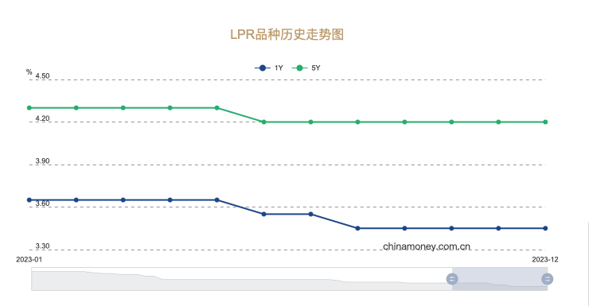

# 下周起贷款即将重定价！部分存量房贷利率还可再降10个基点

新年将至，部分存量贷款即将迎来重新定价。据贝壳财经记者了解，选择将每年1月1日作为“重定价日”、且在今年6月20日以前定价的存量房贷，利率即将再度下调10个基点。这与今年9月底开始的调降存量房利率并不冲突。

房贷利率是由贷款市场报价利率（LPR）和加点两部分组成。今年9月底部分存量房贷利率下调了加点部分，而每年初的重定价则调整的是LPR部分。数据显示，2023年以来，5年期以上LPR共计下调了1次。6月20日，5年期以上LPR下调了10个基点至4.20%。

有业内人士预计，2024年5年期以上品种LPR仍有可能跟随中期借款便利（MLF）利率进一步下调，推动房地产行业尽快实现软着陆。

**存量房贷利率即将再降 与9月调降不冲突**

部分存量房贷利率即将再度下调10个基点。但与9月底开始的调降存量房利率不同的是，此次下调主要是源自于今年以来LPR的调整。

_全国银行间同业拆借中心“LPR品种历史走势”截图。_

据了解，房贷利率是由LPR和加点两部分组成。其中，LPR部分每月20日左右更新一次，并在全国银行间同业拆借中心对外公布，房贷利率主要按5年期以上品种计算；加点部分则因地区、时间、银行而有所不同。

以北京为例，2019年10月至2023年12月14日，首套房贷利率下限LPR+55BP；而2023年12月15日起，城六区首套房贷利率下限为LPR+10BP，非城六区首套房贷利率下限为LPR。

与9月份存量贷款利率调整时下调加点部分不同，LPR虽然每月更新1次，但对于贷款客户而言，其利率每年仅能在合同中约定的“重定价日”调整1次，并以重定价日前公布的最新LPR为准。据了解，大部分贷款客户的重定价日设为每年1月1日。

以北京地区贷款客户为例，若在今年6月以前贷款，首套房贷利率下限为5年期以上LPR+55BP，当时LPR按4.3%计算，即最终利率应为4.85%。若其重定价日为每年1月1日，即按12月20日公布的5年期以上LPR（4.2%）计算，自2024年1月起该客户的贷款利率应下降10个基点至4.75%。

此外，1年期LPR在今年6月和8月分别下调了10个基点，共下调20个基点。这意味着部分贷款期限在5年以下的存量短期利率亦将下调，这主要包括了部分期限在1-3年的企业对公贷款、消费贷款、个人经营贷等。

与房贷构成一样，短期利率亦是由LPR和加点两部分组成，且大部分客户的重新定价日均在每年初。因此，在今年6月20日以前定价的存量短期贷款，利率可降20个基点；而在6月20日至8月20日之间定价的存量短期贷款，利率则可降10个基点。

**LPR明年或有下降空间 银行净息差仍将持续承压**

对于年初的贷款集中重定价，光大证券金融行业首席分析师王一峰认为，银行净息差将面临较大压力。这也是近期主要银行存款利率进一步下调的重要原因之一。

上周五（12月22日），六大国有银行、招商银行率先调降了各期限存款挂牌利率。随后其余11家股份制银行在本周一（12月25日）集中调降了存款挂牌利率。同时，特色存款、大额存单等存款产品利率均同步下调。

“资产负债两端共同挤压下，2024年银行息差收窄压力仍大，适时调整负债成本必要性增强。”王一峰进一步指出，从资产端来看，有效需求不足问题仍待改善，压制新发生贷款利率，明年初滚动重定价亦将带动存量贷款利率进一步下行。而存量按揭利率调降、城投化债等制约因素仍在发挥作用，存量贷款定价下行趋势较难扭转。

对于明年LPR的走势，东方金诚宏观首席分析师王青认为，在当前物价水平仍将低位运行的前景下，着眼于提振内需，支持地方债务风险化解，2024年央行降息降准都有空间。

“2024年上半年MLF操作利率有可能下调1次，届时两个期限品种的LPR报价将跟进下调，进而促进社会综合融资成本稳中有降。”王青预计，
即使2024年MLF利率保持不动，5年期LPR报价不做调整，着眼于推动房地产行业尽快实现软着陆，政策面也会通过全面下调房贷利率下限等方式，引导居民房贷利率较大幅度下行。

此外，招联首席研究员董希淼亦认为，2024年在继续推动政策利率下行，引导银行适度降低存款利率，压降银行负债成本，在近期推动LPR下降5—10个基点，进一步提振市场信心和预期。

新京报贝壳财经记者 姜樊 编辑 陈莉 校对 王心

