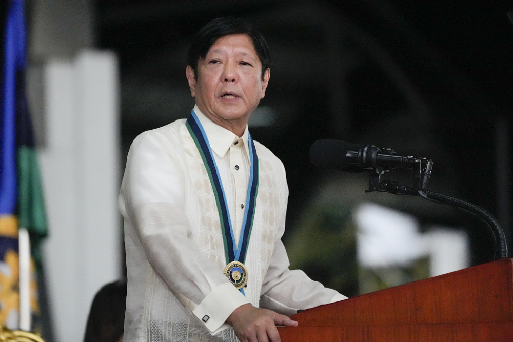

# 仁爱礁问题，菲总统表态“菲律宾打算自己解决”

【环球时报驻菲律宾特派记者 樊帆 环球时报记者
张婷鸽】一段时间以来，菲律宾在南海屡屡生事，不负责任地升高地区紧张局势。不过，对于日媒此前传出菲美已开始就“坐滩”的“马德雷山”号军舰的结构进行非正式讨论的消息，菲律宾总统马科斯日前在接受日本NHK电视台采访时表示，虽然美国一直在帮助菲律宾进行海上巡逻，但就“马德雷山”号的具体情况而言，菲律宾人希望自己解决这个问题。

_菲律宾总统马科斯 资料图_

马科斯表示，“就菲律宾而言，‘马德雷山’号的情况纯粹是菲律宾人关心的问题。因此，我们单方面采取行动，尽一切努力维持在阿云金暗沙
**（即我国仁爱礁——编者注）**
的存在，并确保我们能够向那里的人民提供补给，以便他们能够维持我们的存在……我们认为这是菲律宾的问题，我们打算自己解决这个问题”。

华南理工大学印度洋岛国研究中心研究员彭念26日接受《环球时报》记者采访时分析称，中国外交部连续几天就中菲问题发声，菲律宾应该是已经意识到问题的严重性。马科斯的表态对于中方发出的严厉警告虽不能说是积极回应，但是相对有效的回应。一方面他意在表明，菲在南海问题上没有后退；另一方面，他也想向中方传达，菲律宾要自己解决问题、不愿拉美国介入。应该说，这是目前中菲都能接受的一种回应和处理方式。

彭念同时提到，这个表态真正落实起来还是有难度。菲律宾的船吨位较小、速度较慢，对“坐滩”军舰进行大规模建筑物资补给难度较大，从长远来看，可能还是要借助美国的力量。所以，马科斯现在的表态可能是权宜之计。但对中菲来讲，把南海问题纳入双边轨道才能更好地让冲突降级。

菲武装部队发言人阿吉拉尔26日接受菲律宾国家电视台（PTV）采访时宣称，菲律宾没有在南海挑起冲突。他同时声称，推动多边巡逻是马科斯总统提出的该国维护其专属经济区主权的“范式转变”的一部分，“预计明年会有更多巡逻。”

对此，中国外交部发言人毛宁26日回应称，中方坚定维护自身领土主权和海洋权益。我们也希望菲方作出理智抉择，回到通过对话协商妥处分歧的正确轨道上来，同中方一道管控好海上局势。

彭念表示，我们要认识到，菲外交部和军方有分工协调，所以外界会看到相互矛盾的信号。菲军方更多地受到美国的影响，在南海问题上一直表达强硬立场，我们要做好海上一线应对。

