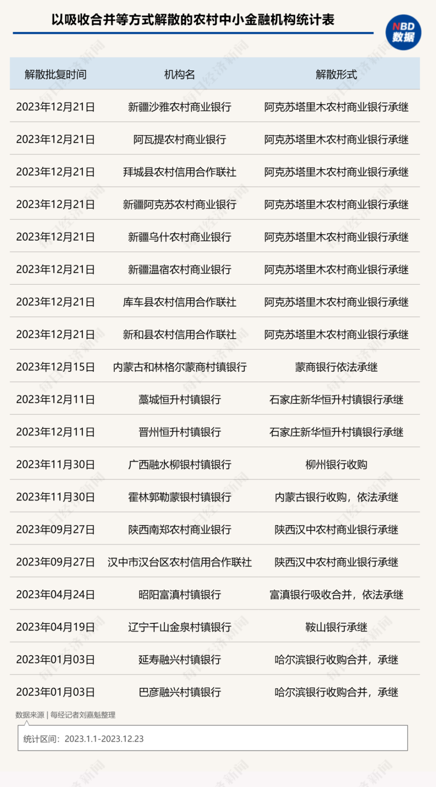

# “收入下降，被收编后打算跳槽”，这些银行人正面临艰难选择

每经记者：刘嘉魁 每经编辑：程鹏,张益铭

**“发展已经到瓶颈了，收入下降，前景不明，没有节假日，心理压力很大。”**
某村镇银行支行长李林（化名）忧心忡忡地说，“被收编后可能矛盾更多，不瞒你说，打算跳槽。”

临近年末，在改革化险的浪潮中，农村中小金融机构解散趋势愈发明显。今年以来， **约30家农村中小银行机构或市场化退出，或因吸收合并而解散。** 而在
**四季度，村镇银行和农村资金互助社等机构的解散仿佛按下了“快进键”，已有22家，几乎是前三季度机构总数的三倍。**

金融从业者们面临着怎样的矛盾与困境？这些机构的解散，是偶然还是必然？将如何影响金融市场？怎样在普惠金融前提下平衡好风险化解和服务提升？

**年内多家银行被吸收合并**

从广义上讲，农村中小金融机构包括农村信用社、农村商业银行、农村合作银行、村镇银行、贷款公司、农村资金互助社等。

今年以来，在中小银行改革化险的大背景下，村镇银行、农村资金互助社等农村中小金融机构加速解散，引发了社会的广泛关注。

《每日经济新闻》 **记者根据国家金融监督管理总局官网不完全统计，截至12月23日，年内已有30家农村中小金融机构获批解散。**

**这些机构包括11家村镇银行、6家农村资金互助社、6家农村商业银行、4家农村信用社、3家贷款公司。**

这些机构的解散，主要有以下几种形式：

**被主发起行吸收合并，改制为主发起行的分支机构。**
这是最常见的一种方式，例如云南省的昭通昭阳富滇村镇银行因被富滇银行吸收合并而解散，该行全部业务、财产、债权债务以及其他各项权利义务等均由富滇银行依法承继。

**被其他同类机构吸收合并。** 例如，藁城恒升村镇银行和晋州恒升村镇银行均被石家庄新华恒升村镇银行吸收合并。

**直接解散，实施市场化退出。**
这种方式一般是在机构经营状况较差，无法继续存续的情况下采取，例如重庆梁平澳新村镇银行的解散批复显示，该行存贷款业务全部清零，自收到批复之日起，立即停止一切经营活动，向监管部门缴回金融许可证，对外做好解散公告，并依法办理清算及注销登记手续。

此外，农村资金互助社的解散方式均为直接解散，清算并注销。

可以看出，部分农村中小金融机构在改革化险过程中被解散，多由于兼并重组，或者经营发展需要等原因。

**解散的机构呈现加速**

**区域集中、多元化趋势**

从解散机构的现状和趋势来看，可以发现以下几个特点：

**解散的机构呈现加速态势。**
近两年来，农村中小金融机构的解散数量远超以前年度，显示出监管部门加快了对这些机构的处置进度。从监管批复时间来看，今年1季度有3家机构获批解散，2季度有2家，3季度有3家，而4季度这一数字激增，达到了22家，几乎是前三季度解散机构总数的三倍。尤其是12月，这一数字达到了17家，超过了全年总数的一半。

**此外，还有部分机构的重组兼并“正在路上”。**
12月9日，陕西秦农农村商业银行公告称，该行将于12月25日召开临时股东大会，审议关于该行吸收合并陕西蓝田农商银行和陕西周至农商银行等议案。

据了解，蓝田农商银行和周至农商银行均已为秦农银行全资子公司。在此之前，秦农银行已相继完成对西安部分法人农合机构的吸收合并工作。

**解散的机构呈现区域集中特征。** 今年以来，被解散的农村中小金融机构主要集中在风险机构较多的地区，例如河北、内蒙古等。

**解散的机构呈现多元化特征。**
今年以来，被解散的农村中小金融机构不仅包括村镇银行，还包括农村资金互助社、农村信用社、农村商业银行、贷款公司等。同时，如前所述，解散的方式也不尽相同，体现了金融监管部门“分类施策”的原则。

**村镇银行从业者：压力大、负担重**

**对合并重组心怀担忧**

农村中小金融机构改革化险的浪潮拍打着每一位从业者。身在其中，五味杂陈。

“化险过程中问题重重，不良压降的压力很大，收入受影响，工作强度也很大，没有周末，没有假期，心理负担重，再这样下去快抑郁了。”某村镇银行支行长李林苦笑道，
**“我们现在已经是高风险机构了，可能某一天单位都不存在了。”**

他所在的村镇银行，亦面临着被主发起行吸收合并的命运。

“作为区域性银行，我们目前的发展已经到瓶颈了，还好有主发起行这个平台撑着。我们可能也要被主发起行合并重组。”李林表示，接下来的流程可能也面临着诸多难以调和的矛盾，很担心被“收编”后的境地。

“站在主发起行角度，也有相应的考量。本来50个人就能办公，面临着并入150人的村镇银行，还有坏账、烂账。说实话，人家可能也不愿意。”李林担心道，蛋糕就那么大，现在要多出三倍的人来分。

“还有一点，主发起行的平台毕竟要更高，相应的招聘要求也高，起码是全日制本科，也不乏名牌大学生。但村镇银行学历参差不齐，甚至还有专科生，招聘标准达不到主发起行的要求，也会造成心理偏差。”李林说，如若被兼并重组，那么这些“格格不入”，是不得不面对的现实问题。

此外，对于被主发起行收编的村镇银行而言，可能还会面临人员安置、企业文化融合等矛盾。要解决这些问题，需要主发起行与被合并机构之间进行充分的沟通和协商，制定详细的整合方案并逐步推进。

对于直接清算的农村资金互助社来说，其面临的困境可能更为复杂。一方面需要解决清算过程中的资产处置、债务清偿等问题；另一方面还需要考虑如何保障农民的权益不受损害。针对这些问题，需要政府、监管部门和社会各方面的共同努力来寻求解决方案。

要化解这些矛盾，加强政策引导和支持力度，完善法律法规和监管制度，推动金融机构之间的合作与交流，加强社会监督和舆论引导……缺一不可。

**农村中小金融机构改革化险**

**解散是必然选择？**

村镇银行和资金互助社的解散，是中小银行改革化险的缩影。

近年来，中小银行面临着经营效率、资产质量、资本充足水平、公司治理、风险防控等多重挑战。为何这类机构的挑战尤其突出？

“这些机构发展的历史背景与其风险密切相关。”一位农村中小金融机构监管专家表示，农村中小金融机构的产生与扩张，主要是为了满足农村地区金融供给不足的问题，以及促进农村经济和社会的发展。这些机构的发起和管理，多依赖于当地的政府、企业和个人，其治理结构和内部控制较为薄弱，容易受到地方保护和利益输送的影响。

他表示， **金融监管的加强和规范，也促使了这些机构进行市场化的优化和退出。**

近年来，金融监管部门不断加强对农村中小金融机构的监管，例如严格要求其资本充足率、拨备覆盖率、不良贷款率等监管指标达标，强化了风险管理和内部控制的要求，规范了关联交易和利益输送的行为，推动市场化的改革和重组。“这些监管措施，既是为了提升这些机构的经营效率和风险防范能力，也是为了保护金融消费者的合法权益，维护金融稳定和安全。”

此外， **从客观环境来看，农村金融市场的变化和竞争也影响了这些机构的生存发展。**

他认为，随着农村金融市场的需求和供给变化，其他更大的银行下沉了服务网点，同时农村金融消费者的金融需求和偏好也在升级，农村金融机构的竞争格局不断演变。“这类机构的竞争优势相对就没那么大了。”

一方面，随着新农村建设和城镇化建设的稳步推进，农村地区的经济和社会发展水平不断提高，农村金融消费者的金融需求不仅仅局限于简单的存贷业务，而是更加多元化和个性化，对金融产品和服务的质量和效率也有更高的要求。

另一方面，随着金融市场的开放竞争，以及金融科技的发展创新，农村金融市场的供给端呈现出多样化的趋势。除了传统的农村金融机构外，还有其他大型商业银行、互联网金融平台、金融科技公司等新兴的金融机构和模式，为农村金融消费者提供了更多的选择和便利。

在这样的市场环境下，一些农村中小金融机构业务类型和范围较为单一，服务水平和创新能力不足，无法满足农村金融消费者的需求和偏好，也无法抵御其他金融机构的竞争压力的机构，就难以保持其市场份额和利润空间，甚至会出现客户流失和资金断裂的风险，从而导致其经营困难和解散。

如此背景下，部分村镇银行、资金互助社等农村中小金融机构的解散，是必要的市场化调整，也是有效的风险防控手段。

**如何在普惠金融前提下**

**平衡好风险化解和服务提升？**

近年来，中央金融工作会议多次强调要全面加强金融监管，有效防范化解金融风险，其中一条就是及时处置中小金融机构风险。今年年中发布的《2022中国金融稳定报告》也指出，区域经济发展不平衡进一步凸显，中小金融机构风险呈现区域集中特征，需完善中小银行公司治理，多渠道补充中小银行资本，加快不良资产处置。

2021年初，银保监会发布《关于进一步推动村镇银行化解风险改革重组有关事项的通知》（下称《通知》），提出支持主发起行向村镇银行补充资本以及协助处置不良贷款，适度有序推进村镇银行改革重组。

《通知》指出，对于有出资意愿和处置能力的主发起行（含农村合作银行和农村信用社），属地银保监局和并表银保监局可根据风险处置的实际需要，按规定程序审慎研究确定其对村镇银行增资所需满足的监管评级、监管指标等相关条件，支持其向所发起设立的高风险村镇银行增资扩股，或在真实、洁净、合规的前提下，通过多种方式协助处置不良贷款。

可以看出，根据监管规定，主发起行对其发起的村镇银行在一定程度上要承担连带责任，即当村镇银行出现资本不足或者资产质量恶化时，主发起行或要对其进行资本补充或者资产处置，这给主发起行带来了比较大的资本压力，尤其是“自身难保”的主发起行。因此，通过解散某些村镇银行，可以减轻主发起行的资本负担，提高其资本充足率，增强其抵御风险的能力。

从化险的角度看，村镇银行和农村资金互助社的解散，还有利于消除金融系统不良资产，提高资产质量。

一般而言，村镇银行和资金互助社的平均不良贷款率普遍高于其他类型的银行，这与其服务的客户群体、业务范围、风险管理水平等因素有关。这些不良资产，不仅占用了金融资源，降低了金融效率，而且可能引发信用风险、流动性风险、市场风险等，甚至波及其他金融机构，形成系统性风险。因此，通过解散这些机构，可以消除一些不良资产，提高资产质量，减少风险的传染和扩散。

由此可见，部分农村中小金融机构的解散，一方面可以有效地消除一些高风险的机构，提高金融系统稳定性，另一方面，解散也可能在一定程度上导致部分农村地区金融服务的缺失。因此，如何在不影响金融普惠的前提下，平衡好风险化解和服务提升，是中小银行改革化险的重要议题。

“完善金融监管法律法规，加强金融监管的协调性、透明度等，自然是题中之义。”前述监管专家认为，应对新情况，就要用新办法，例如运用金融科技手段，提升金融监管的数据采集、分析、预警、处置等能力，实现金融监管的精准化和智能化。

他表示，金融创新是满足金融需求的重要途径。金融机构可根据农村地区的金融需求，探索拓展更加多样化、差异化、个性化的金融产品和服务。

“在化险的同时，也要进一步优化金融渠道和网络，如利用金融科技手段，建立和完善农村地区的金融基础设施，提高农村地区的金融可及性、便利性、安全性。”

他认为，金融机构在业务开展过程中，也要加强与地方政府和监管部门的沟通协调机制，如政策支持、信息交流、风险防范、危机处置等，稳稳地落地金融政策，提高金融服务的质量。“增强金融系统稳定性和风险化解一样，都需要多方合力。”

**记者|** 刘嘉魁

**编辑|** 程鹏 张益铭 杜恒峰

**校对|** 王月龙

封面图片来源：视觉中国

｜每日经济新闻 nbdnews 原创文章｜

未经许可禁止转载、摘编、复制及镜像等使用

