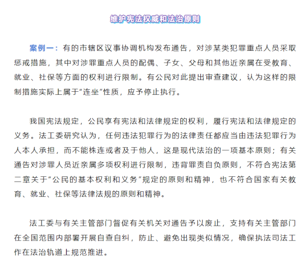

# 马上评｜人大法工委叫停“连坐”，宪法常识必须捍卫

“涉罪人员近亲属多项权利进行限制，违背罪责自负原则，不符合宪法第二章关于‘公民的基本权利和义务’规定的原则和精神。”全国人大常委会法工委对“连坐”亮出了鲜明态度——违反宪法原则。

12月26日，全国人大常委会法工委主任沈春耀向十四届全国人大常委会第七次会议报告2023年备案审查工作情况，报告中还公布了多起备案审查典型案例。报告称，有的市辖区议事协调机构发布通告，对涉某类犯罪重点人员采取惩戒措施，其中对涉罪重点人员的配偶、子女、父母和其他近亲属在受教育、就业、社保等方面的权利进行限制。

法工委明确：任何违法犯罪行为的法律责任，都应当由违法犯罪行为人本人承担，而不能株连或者及于他人，这是现代法治的一项基本原则。有关通告对涉罪人员近亲属多项权利进行限制，违背罪责自负原则，不符合宪法第二章关于“公民的基本权利和义务”规定的原则和精神。

_全国人大常委会法工委公布的备案审查相关案例_

株连违反宪法原则！目前，法工委已与有关主管部门督促有关机关对通告予以废止，支持有关主管部门在全国范围内部署开展自查自纠，防止、避免出现类似情况。

检索相关新闻可以发现，有一些地方对涉电诈人员的近亲属特别是未成年子女实施了株连性的惩戒措施。2020年，福建省龙岩市新罗区针对涉电诈人员提出了“十个一律”的措施：“凡是参与电信网络新型违法犯罪嫌疑人的子女，一律在城区学校就读时予以招生入学限制。”今年5月，福建泉州泉港区发布涉诈重点人员惩戒措施，其配偶、父母、子女暂停享受大病保险补助政策和医保财政补贴，并且要“严审其子女就学资格，……一律不得就读城区学校”。

这些针对涉电诈人员亲属的株连措施，之前也曾被一些网友吹捧为“十分舒适”“立竿见影”，大有网络爽文的快感，引发了一片廉价的掌声、致敬的口水，乃至违背法治的民粹主义的狂欢。

而这次全国人大法工委明确对“连坐”说不，捍卫了社会主义的法治常识，不飘摆、不迎合，向之前个别地区走极端、越底线的打击手段浇了一盆凉水。

罪责自负是现代法治的重要基石之一，它意味着国家在进行刑事责任追究时，不能将犯罪人应承担的责任转嫁给第三人。接受教育关涉到一个人的前途，一个人的前途应该由自己来决定，而不是由其父母的犯罪记录所决定。不让涉电诈人员的子女接受正常的教育，他们更容易滑向社会边缘，结果重走父母亲犯罪的道路，到头来还是加重了社会负担，扩大了社会对立面，把一代人的犯罪变成两代人的犯罪，让犯罪成为可耻的身份继承。这也是现代社会抛弃“株连”“连坐”制度的原因所在。要说明的是，我国法院限制“老赖”子女入读“高收费私立学校”，是为了防止转移财产，而不是限制其子女接受正常的教育，这不是“连坐”。

治理犯罪是一项庞大的社会工程，需要铲除犯罪的社会土壤、切断犯罪网络的灰色社会连接。打击犯罪，更要坚守法治的底线，要以正治邪，而不是“以暴制暴”。当下社交平台发达，民粹主义抬头，暴戾心态升腾，这更考验基层执法部门对于全面推进依法治国的定力和信心，不能“在廉价的叫好声中迷失自我”，推出逾越法律底线、宪法底线的措施。

这一次，全国人大法工委叫停“连坐”规定，并且推动全国范围内部署开展自查自纠，也说明我国以“备案审查”为重要形式的合宪性审查机制，日益健全完善，对于违反宪法、侵犯公民权利的地方法规、规范性文件敢于“硬碰硬”。

之前，地方立法、地方规范性文件推出的“超生即开除”、“卫健委强制做亲子鉴定”等不合理规定，以及任意扩大袭警罪的认定范围等问题，都得到了有效纠正。人大的法规审查职能被进一步激活，宪法的生命和权威得到强化。

人大备案审查的阳光照进现实，中国的宪法实践步稳蹄疾。不搞株连的宪法常识，需要一说再说，才能深入人心。

